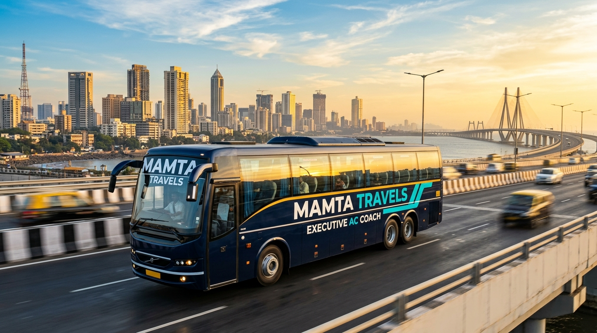

<div align="center">

# 🚌 Mamta Travels

### Premium App-Based AC Bus Service for Daily Office Commuters

[](https://github.com/saurabhpandey0924-sys/-Mamta-Travels-)
[](https://developer.mozilla.org/en-US/docs/Web/HTML)
[](https://developer.mozilla.org/en-US/docs/Web/CSS)
[](https://developer.mozilla.org/en-US/docs/Web/JavaScript)
[](https://leafletjs.com/)

**Mamta Travels** is a modern, responsive web application for a premium daily commuter bus and executive car service — operating across Mumbai, Thane, Navi Mumbai and Hyderabad.

[🌐 Live Demo](http://localhost:8080/) • [📱 Mobile Friendly](#responsive-design) • [✨ Features](#features)



</div>

---

## 🌟 Overview

Mamta Travels is an app-based intercity AC bus and luxury car service designed for daily office commuters. This website replicates a premium commuter mobility platform (inspired by Cityflo) — rebuilt with a unique **Imperial Sapphire & Electric Cyan** brand identity.

The website is a fully responsive, single-page application with:
- Interactive route maps powered by **Leaflet.js**
- Phone mockup animations for app onboarding
- Dynamic seat booking UI
- Corporate commute ROI calculator
- **Mamta LUXE** premium chauffeur fleet section

---

## ✨ Features

### 🎯 Core Sections
| Section | Description |
|---|---|
| **Hero** | Animated headline cycler with rotating taglines, live bus status badges |
| **Route Explorer** | Interactive Leaflet.js map with polyline animation & route cards |
| **Mamta Pass** | Subscription plan cards (Daily, Monthly, Corporate) |
| **How It Works** | Animated phone mockup with step-by-step app demo |
| **Experience Cards** | Photo showcards with floating captions |
| **Corporate Section** | Interactive savings calculator with sliders |
| **Mamta LUXE** | Premium chauffeur fleet (Innova, Hyryder, Electric SUV) |
| **Testimonials** | Customer reviews with star ratings |
| **Footer** | App download CTAs, navigation links, social media |

### 🚀 Technical Highlights
- **Liquid Glass Navbar** — Glassmorphism floating capsule that hides on scroll-down, returns on scroll-up
- **Leaflet.js Interactive Map** — Custom styled route polylines with animated dash effect, pulsing bus markers, clickable stop popups
- **Seat Booking Modal** — Animated seat grid with available/booked/selected states
- **Corporate ROI Calculator** — Real-time savings calculation with animated sliders
- **CSS Animations** — Hero ken-burns zoom, live pulse dots, radar spin, step progress bars
- **Fully Mobile Responsive** — Tested on iPhone 14 (390px), iPad (768px), Desktop (1280px)

---

## 🎨 Brand Identity

| Token | Value | Usage |
|---|---|---|
| Primary | `#0a192f` Imperial Sapphire | Nav, headings, buttons |
| Accent | `#00c2cb` Electric Cyan | CTAs, highlights, glow effects |
| Gold | `#f59e0b` Sovereign Gold | Star ratings, Mamta Cash |
| LUXE BG | `#090b10` Deep Noir | LUXE section dark canvas |
| LUXE Gold | `#dfb876` Champagne | LUXE vehicle cards |

**Fonts:** [Outfit](https://fonts.google.com/specimen/Outfit) (headings) + [Plus Jakarta Sans](https://fonts.google.com/specimen/Plus+Jakarta+Sans) (body)

---

## 📁 Project Structure

```
mamta-travels/
├── index.html              # Main SPA entry point
├── css/
│   ├── main.css            # Design system tokens, global styles, buttons
│   ├── navbar.css          # Floating glass capsule navbar + mobile drawer
│   ├── hero.css            # Hero section + headline cycler animation
│   ├── routes.css          # Route cards, Leaflet map, shift switcher
│   ├── experience.css      # Offerings, experience cards, bonus banner
│   ├── mockups.css         # Phone mockup + how-it-works steps
│   ├── corporate.css       # Corporate section + savings calculator
│   ├── luxe.css            # Mamta LUXE dark section + fleet cards
│   ├── modals.css          # Seat booking + route detail modals
│   ├── footer.css          # Footer, app download, testimonials
│   └── responsive.css      # Comprehensive mobile/tablet responsive overrides
├── js/
│   ├── navbar.js           # Scroll hide/show, mobile drawer, CTA interactions
│   ├── hero-canvas.js      # Particle canvas animation for hero background
│   ├── route-finder.js     # Leaflet.js map init, route polylines, markers
│   ├── mockups.js          # Phone mockup step transitions + auto-advance
│   ├── modals.js           # Seat booking modal logic
│   └── corporate.js        # Savings calculator slider logic
├── assets/
│   └── images/
│       ├── hero_bus.jpg          # Branded Mamta Travels coach bus on Mumbai expressway
│       ├── bus_expressway.jpg    # Bus on coastal highway with branding
│       ├── electric_suv.jpg      # LUXE electric SUV at Aditya Birla Centre
│       ├── hyryder.jpg           # Mamta LUXE Hyryder at Mumbai Airport T2
│       ├── innova_crysta.jpg     # Innova at BKC with chauffeur
│       ├── luxe_chauffeur.jpg    # Premium chauffeur service visual
│       ├── bus_interior.jpg      # Luxury interior with recliner seats
│       └── commuter_window.jpg   # Happy commuter at window seat
├── package.json            # Vite dev server config
├── vite.config.js          # Vite configuration
└── README.md               # This file
```

---

## 📱 Responsive Design

The website is fully responsive across all device sizes:

| Device | Breakpoint | Layout |
|---|---|---|
| Mobile (iPhone) | `< 640px` | Single column, full-width CTAs, slide-up modals |
| Mobile (Large) | `640px – 767px` | Single column, compact hero |
| Tablet (iPad) | `768px – 1023px` | 2-column grids, hamburger nav |
| Desktop | `≥ 1024px` | Full layout, desktop nav, multi-column grids |

---

## 🛠️ Tech Stack

| Technology | Purpose |
|---|---|
| **HTML5** | Semantic structure |
| **Vanilla CSS3** | All styling (no frameworks) |
| **Vanilla JavaScript** | All interactivity (no frameworks) |
| **Leaflet.js** | Interactive route maps |
| **Vite** | Local dev server + HMR |
| **Google Fonts** | Outfit + Plus Jakarta Sans |

---

## 🚀 Getting Started

### Prerequisites
- [Node.js](https://nodejs.org/) (v18+)
- npm

### Installation & Running Locally

```bash
# 1. Clone the repository
git clone https://github.com/saurabhpandey0924-sys/-Mamta-Travels-.git

# 2. Navigate to the project folder
cd "-Mamta-Travels-"

# 3. Install dependencies
npm install

# 4. Start the dev server
npm run dev
```

The site will be available at **http://localhost:8080/**

---

## 🗺️ Route Coverage

Currently serving:
- 🔴 **Mumbai → BKC** (Thane West → Bandra Kurla Complex)
- 🔴 **Mumbai → Andheri** (Kharghar → Andheri West)
- 🟢 **Hyderabad Tech Corridor** (HITEC City ↔ Gachibowli)

More routes coming soon across Pune, Bengaluru, and Chennai!

---

## 🏢 Mamta LUXE — Executive Fleet

Premium chauffeur service with:
- 🚙 **Toyota Innova Crysta** — 7-seater luxury MPV
- 🚙 **Maruti Suzuki Hyryder** — Premium Hybrid SUV
- ⚡ **Electric SUV** — Zero-emission executive mobility
- 👔 Uniformed professional chauffeurs
- 📱 App-based booking with live tracking

---

## 📄 License

This project is for demonstration purposes. All brand assets and vehicle images are AI-generated.

---

<div align="center">

Made with ❤️ for **Mamta Travels** | Premium Commuter Mobility

</div>
